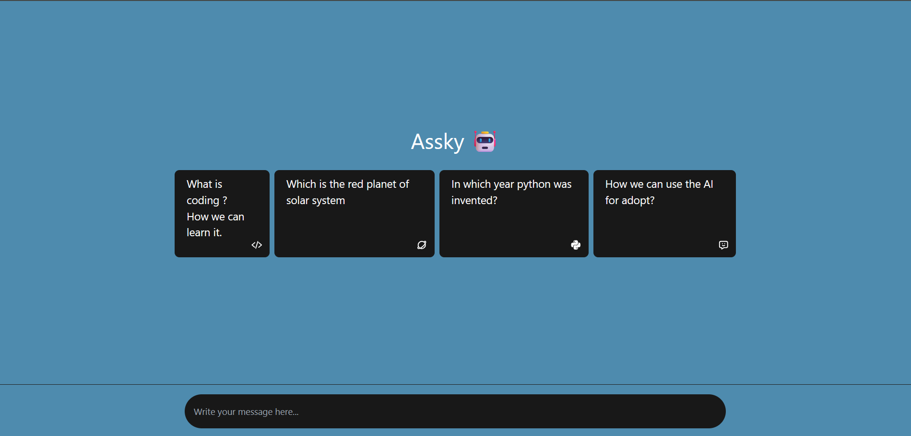
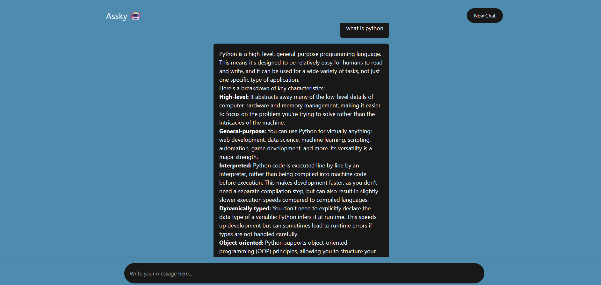

# 🤖 Assky – AI Chatbot with Google Gemini API

**Assky** is an intelligent, responsive chatbot interface built using **React.js** and powered by **Google Gemini 1.5 Pro** via the `@google/generative-ai` SDK. It allows users to interact with an AI model through a clean, chat-style interface that supports markdown rendering, prompt cards, and seamless messaging.

## 🚀 Live Demo

[Click here to try it live](https://your-deployment-link.com) 

---

## ✨ Features

- 🔹 Sleek, mobile-responsive UI using Tailwind CSS
- 🔹 Real-time AI interaction with Gemini 1.5 Pro
- 🔹 Markdown support for better readability of AI responses
- 🔹 Prompt suggestions for quick interactions
- 🔹 Input via Enter key or send icon
- 🔹 Separate styling for user and bot messages

---

## 🖼️ Screenshots

### Initial Prompt Cards

### Chat Interface

---

## 🛠️ Tech Stack

- **React.js**
- **Tailwind CSS**
- **Google Generative AI SDK**
- **React Markdown**
- **React Icons**

---

## 🧠 How It Works

1. The user enters a message or selects a prompt card.
2. The message is sent to Google's Gemini model via their Generative AI SDK.
3. A response is returned and rendered using markdown formatting.
4. Each user and bot message is shown in a chat-style conversation thread.

---

## 🔐 API Key Setup

To use the Gemini API, you need an API key from Google AI Studio.

